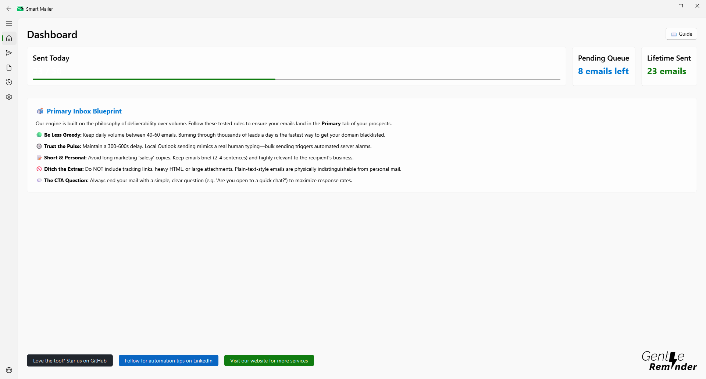
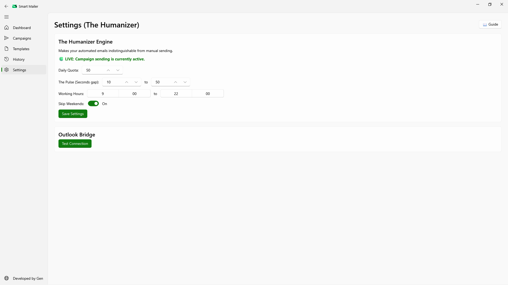
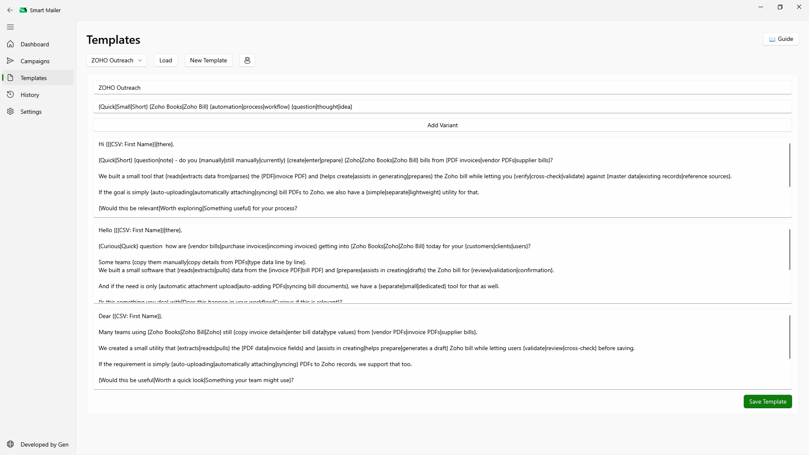

<h1 align="center">Gentle Reminder - Smart Automated Mailer</h1>

<p align="center">
  <strong>A Powerful, Desktop-based Cold Emailing Engine with Humanized Sending and Spintax</strong>
</p>

<p align="center">
  <a href="https://drive.google.com/drive/folders/1ug5-0RRzf0qnXCl97m5jPbbEckME3VpK?usp=sharing">
    <strong>🚀 Download Portable EXE (v1.0)</strong>
  </a>
</p>

## Overview

Gentle Reminder is a beautiful, locally-hosted desktop application designed for small businesses and founders to manage their outbound email campaigns effectively. It completely removes the need for expensive SAAS subscriptions by connecting directly to your local Outlook client via Windows COM objects (`pywin32`) to send mail exactly as a human would.

Complete with an integrated Database management system, built-in Spintax (dynamic word spinning algorithms to dodge spam filters), and a strict "Humanizer" scheduler to mimic natural working hours, this app ensures your emails reach the primary inbox securely.



## Why Gentle Reminder?

Unlike cloud-based mailers that send via bulk SMTP servers (often instantly flagged by Gmail/Outlook spam algorithms), Gentle Reminder uses your computer's native Microsoft Outlook client. It literally opens Outlook in the background and clicks "Send" for you, one by one, with randomized microscopic delays. To the recipient's mail server, it is physically indistinguishable from a human typing and sending an email.

---

## Setup Instructions (Development)

### Requirements

- Windows OS (Required for `pywin32` Outlook COM Integration)
- Microsoft Outlook (Must be installed and signed into an active account)
- Python 3.10+

### Installation

1. Clone this repository:

   ```bash
   git clone https://github.com/yourusername/mail-automator.git
   cd mail-automator
   ```

2. Create a virtual environment and map dependencies:

   ```bash
   python -m venv venv
   source venv/Scripts/activate
   pip install -r requirements.txt
   ```

3. Run the application:
   ```bash
   python main.py
   ```

---

## Packaging the Application (PyInstaller)

If you wish to distribute this application as an executable `.exe` file without requiring Python installations, you can compile it using `PyInstaller`.

1. Install PyInstaller into your virtual environment:

   ```bash
   pip install pyinstaller
   ```

2. Run the build command attached to the hidden `main` entrypoint, making sure to bundle the PyQt assets:

   ```bash
   pyinstaller --noconfirm --onedir --windowed --icon "assets/icon.ico" --add-data "assets;assets/" main.py
   ```

3. The final EXE will be generated inside the `dist/main` folder. Simply zip this folder up to distribute your software!
   > **Note:** Because the application relies on an internal SQLite database (`mailer_state.db`), this file will automatically generate itself locally in the user's directory the first time they run the `.exe`.

---

## 📖 How To Use

### 1. Settings & Scheduler (The Humanizer Engine)

Before starting, set your daily limit (e.g., 50 emails) and define your working hours. The "Humanizer Engine" strictly enforces these rules. If an email campaign is running outside of working hours, or on a weekend (if you've checked "Skip Weekends"), it will dynamically pause the Queue and resume sending on Monday morning!



### 2. Building Templates

Create highly dynamic templates integrating CSV variables.

- Use `{{CSV:First Name}}` to inject columns dynamically.
- Use Spintax `{Hello|Hi|Hey}` to drastically reduce spam flagging. The engine will pick a random phrase for every single individual email sent.
- Add "Variants" to automatically round-robin test entirely different email bodies across a group.



### 3. Audience Manager

Import your CSV data. Map your primary email column, and give your import a Category Name (e.g., "SaaS CEOs Q3"). The system will ingest all extra columns automatically as JSON metadata, ready to be called by your template variables.

You can use the built-in Contact Table to:

- Manually inject single new records perfectly typed.
- View your entire imported list.
- Highlight opted-out individuals and click the `🗑 Delete Selected` button to permanently scrub them from that Category to prevent accidental sends.

### 4. Launch Campaign

Once your Audience categories are loaded and clean, head to the Launch tab.

1. Select your target Template.
2. Select one, or multiple Categories using the checkbox list!
3. Click "Launch Campaign"!

The application uses a Background Thread Worker to quietly process your queue while keeping the dashboard perfectly fluid. You can cancel or pause jobs at any time from the UI.
